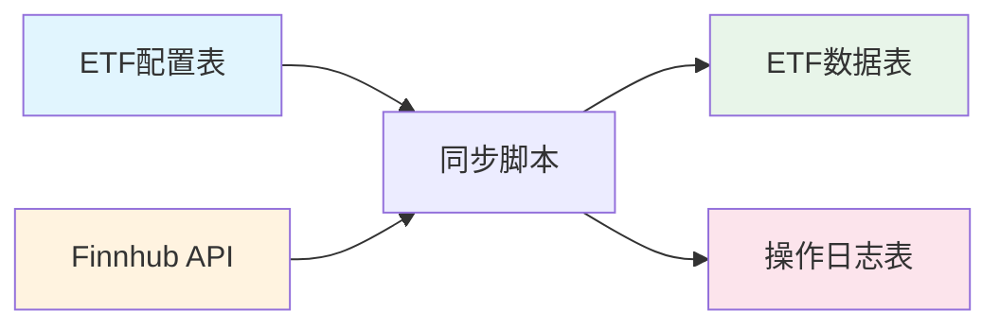

## 产品概述

ETF数据同步系统需要重新梳理和优化，使用Finnhub API获取真实实时数据，替代原有的模拟数据方案。

## 核心功能需求

1. **Finnhub API集成**: 使用提供的API Key (API_KEY32OKXGQOWALVCQKRWGB038278TDRL6R1) 连接Finnhub获取实时ETF数据
2. **代理配置支持**: 适配用户的Clash VPN代理（端口7897），通过环境变量配置HTTP代理
3. **数据同步流程**: 从数据库读取ETF配置，批量获取实时行情，更新到etf_data表
4. **错误处理与日志**: 完善的错误处理和操作日志记录（使用models.OperationLog）
5. **数据后备机制**: API失败时优雅降级到模拟数据
6. **数据库更新**: 正确处理唯一约束，支持重复运行不报错

## 数据模型

- **ETFConfig**: ETF配置信息（symbol, name, category, provider等）
- **ETFData**: 每日行情数据（symbol, date, open/close/high/low price, volume）
- **OperationLog**: 操作日志记录（operation_type, status, error_message等）

## 技术栈

- **语言**: Go
- **数据库**: SQLite (GORM ORM)
- **API**: Finnhub REST API
- **代理**: HTTP_PROXY/HTTPS_PROXY环境变量

## 架构设计

### 数据流架构



### 组件职责

1. **FinnhubClient** (services/finnhub.go)

- HTTP客户端封装，支持代理配置
- 速率限制（60 calls/sec）
- 批量获取股票报价
- 响应数据转换

2. **SyncETF Script** (cmd/syncetf/main.go)

- 读取ETF配置列表
- 调用Finnhub API获取实时数据
- 更新ETFConfig和ETFData表
- 记录操作日志
- 错误处理和后备机制

### 关键优化点

1. **代理配置**: 自动读取HTTP_PROXY/HTTPS_PROXY环境变量
2. **速率限制**: 使用channel实现令牌桶限流，避免触发API限制
3. **并发优化**: 批量获取数据，减少API调用次数
4. **数据一致性**: 使用Save方法处理symbol+date唯一约束
5. **可观测性**: 记录详细的操作日志，便于排查问题

## 目录结构

```
backend/
├── services/
│   ├── finnhub.go         # [MODIFY] 完善错误处理和日志
│   └── yahoo_finance.go   # [EXISTING] QuoteData通用结构
├── cmd/syncetf/
│   └── main.go            # [MODIFY] 优化同步流程和日志记录
└── models/
    ├── models.go          # [EXISTING] ETFConfig, ETFData, OperationLog
    └── db.go              # [EXISTING] 数据库连接
```

## 执行流程

1. 初始化数据库连接
2. 创建Finnhub客户端（自动加载API Key和代理配置）
3. 从数据库或配置读取ETF列表
4. 批量调用Finnhub API获取实时报价
5. 转换数据格式并更新数据库
6. 记录操作日志
7. 输出同步结果统计