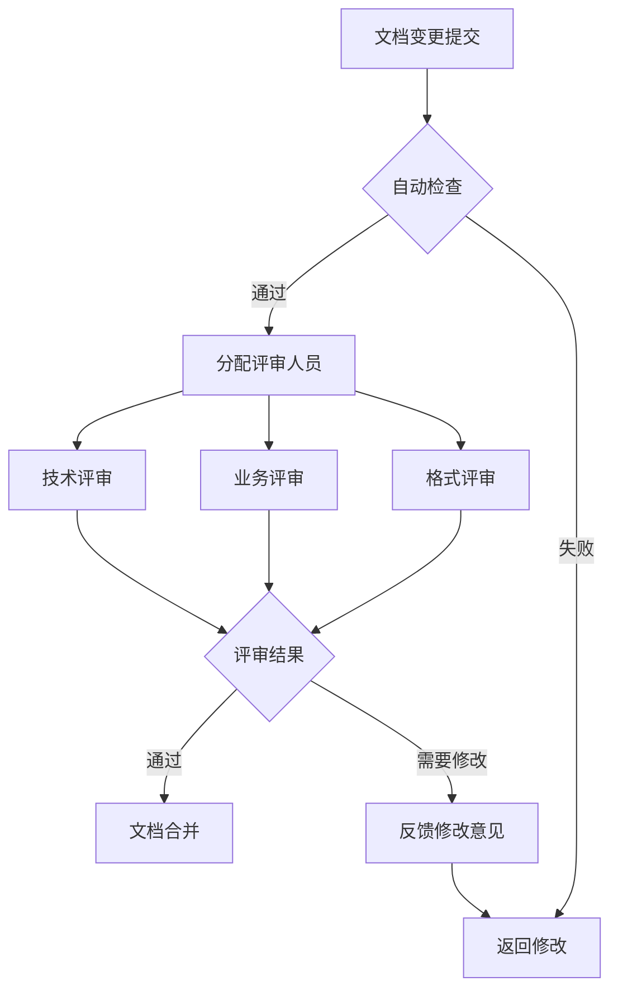

# 文档评审机制

## 概述

本文档定义了文档更新的评审流程和标准，确保更新后的文档质量和准确性，维护文档与代码的强一致性。

## 评审流程

### 1. 评审触发条件

#### 自动触发评审：
- ✅ **代码合并请求** - 包含文档变更的PR自动触发评审
- ✅ **版本发布** - 每个版本发布前必须进行文档评审
- ✅ **架构变更** - 重大架构调整后的文档评审

#### 手动触发评审：
- ⚠️ **复杂功能** - 新增复杂功能的文档评审
- ⚠️ **API变更** - 影响外部接口的文档变更
- ⚠️ **用户指南** - 面向最终用户的文档更新

### 2. 评审参与角色

| 角色 | 职责 | 评审重点 |
|------|------|----------|
| **技术负责人** | 整体技术准确性 | 架构设计、技术实现 |
| **模块负责人** | 模块功能准确性 | 功能描述、接口定义 |
| **产品经理** | 业务逻辑准确性 | 用户场景、功能价值 |
| **文档专员** | 文档质量保证 | 格式规范、语言表达 |
| **测试人员** | 使用示例验证 | 示例代码、配置说明 |

### 3. 评审流程步骤



## 评审标准

### 1. 技术准确性评审

#### 代码一致性检查清单：
- [ ] **功能描述** - 文档描述与代码实现完全一致
- [ ] **接口定义** - API路径、方法、参数与实际代码匹配
- [ ] **参数说明** - 参数类型、约束条件、默认值准确
- [ ] **响应格式** - 成功/错误响应结构与代码一致
- [ ] **错误处理** - 错误码、异常情况说明完整
- [ ] **数据模型** - 字段定义、关联关系准确

#### 技术实现检查清单：
- [ ] **算法说明** - 核心算法逻辑描述准确
- [ ] **性能特性** - 性能指标、限制条件说明清楚
- [ ] **安全考虑** - 安全机制、权限控制说明完整
- [ ] **依赖关系** - 第三方库、系统依赖说明准确

### 2. 业务逻辑评审

#### 功能价值检查清单：
- [ ] **用户场景** - 目标用户、使用场景描述清晰
- [ ] **问题解决** - 解决的具体问题说明明确
- [ ] **价值体现** - 功能价值、业务收益表述清楚
- [ ] **竞品对比** - 差异化优势说明准确（如适用）

#### 使用流程检查清单：
- [ ] **安装部署** - 安装步骤、环境要求完整
- [ ] **配置说明** - 配置项、参数说明详细
- [ ] **操作指南** - 使用步骤、操作流程清晰
- [ ] **故障排除** - 常见问题、解决方案实用

### 3. 文档质量评审

#### 内容质量检查清单：
- [ ] **结构清晰** - 章节划分合理，逻辑层次分明
- [ ] **语言规范** - 用词准确，语句通顺，无语法错误
- [ ] **术语统一** - 专业术语使用一致，无歧义
- [ ] **示例完整** - 代码示例、配置示例可运行
- [ ] **图表规范** - 图表清晰，标注准确，格式统一

#### 格式规范检查清单：
- [ ] **Markdown语法** - 符合Markdown规范，无语法错误
- [ ] **标题层级** - 标题层级合理，不超过6级
- [ ] **代码块** - 代码块语言标注正确，格式规范
- [ ] **表格格式** - 表格对齐规范，内容清晰
- [ ] **链接有效** - 内部链接、外部链接有效可用

## 评审工具和方法

### 1. 自动化检查工具

#### 一致性检查报告：
```bash
# 生成详细检查报告
python scripts/consistency_checker.py --report --output review_report.md

# 检查特定模块
python scripts/consistency_checker.py --module etf --report
```

#### 报告内容示例：
```markdown
# 文档一致性评审报告

## 检查摘要
- 一致性得分: 85.2/100
- 发现问题总数: 3
- 代码元素数量: 156
- 文档章节数量: 24

## 问题详情
1. [HIGH] missing_code_element
   消息: 文档中提到的代码元素 'NewOptimizationService' 在代码中不存在
   文档: README.md:45
   代码: backend/services/optimization/

2. [MEDIUM] undocumented_feature
   消息: 代码中实现的功能 '持仓穿透分析' 在文档中未提及
   功能: 持仓穿透分析
   代码: backend/services/portfolio/penetration.go
```

### 2. 人工评审方法

#### 代码-文档对照检查：
1. **逐行对照** - 重要代码块与对应文档段落逐行检查
2. **功能验证** - 根据文档描述验证代码功能实现
3. **接口测试** - 按照文档说明测试API接口
4. **示例运行** - 运行文档中的代码示例验证正确性

#### 交叉验证方法：
1. **多角色验证** - 不同角色从各自角度验证文档准确性
2. **实际使用验证** - 按照文档步骤进行实际使用验证
3. **历史版本对比** - 与历史版本文档对比检查变更合理性

## 评审结果处理

### 1. 评审结果分类

#### 通过 (Approved)
- 所有检查项通过
- 无重大技术问题
- 文档质量符合标准

#### 需要修改 (Needs Revision)
- 存在技术不准确问题
- 文档质量需要改进
- 使用示例需要验证

#### 拒绝 (Rejected)
- 严重的技术不准确
- 文档与代码严重不符
- 存在安全风险说明

### 2. 修改反馈机制

#### 反馈格式要求：
```markdown
## 评审反馈 - [文档名称]

### 技术问题
- [ ] 问题描述：接口路径与实际代码不符
   - 位置：第45行
   - 建议：将 `/api/v1/etf` 改为 `/api/v2/etf`
   - 优先级：高

### 内容问题
- [ ] 问题描述：功能描述过于简略
   - 位置：功能特性章节
   - 建议：增加使用场景和限制条件说明
   - 优先级：中

### 格式问题
- [ ] 问题描述：代码块缺少语言标注
   - 位置：第78行代码示例
   - 建议：添加 ````go` 语言标注
   - 优先级：低
```

#### 修改跟踪：
- 每个问题分配唯一标识
- 记录修改负责人和预计完成时间
- 修改完成后进行验证确认

### 3. 重新评审流程

1. **修改提交** - 作者根据反馈完成修改
2. **修改验证** - 评审人员验证修改内容
3. **补充评审** - 如有必要进行补充评审
4. **最终批准** - 所有问题解决后批准合并

## 质量指标和监控

### 1. 评审质量指标

| 指标 | 目标值 | 测量方法 |
|------|--------|----------|
| **一次通过率** | ≥ 70% | 首次评审通过的比例 |
| **平均评审周期** | ≤ 2天 | 从提交到批准的时间 |
| **问题密度** | ≤ 0.5个/千字 | 每千字文档的问题数 |
| **修改完成率** | 100% | 反馈问题的完成比例 |

### 2. 文档质量指标

| 指标 | 目标值 | 测量方法 |
|------|--------|----------|
| **一致性得分** | ≥ 80分 | 自动化检查工具评分 |
| **文档覆盖率** | ≥ 80% | 重要代码元素的文档覆盖比例 |
| **用户满意度** | ≥ 4.0/5.0 | 用户反馈调查评分 |
| **更新及时性** | ≤ 1天 | 代码变更到文档更新的时间差 |

### 3. 持续改进

#### 定期评审回顾：
- 每月进行评审流程回顾
- 分析评审数据，识别改进点
- 优化评审标准和流程

#### 评审人员培训：
- 定期组织评审标准培训
- 分享优秀评审案例
- 提供评审工具使用指导

## 附录

### 评审模板

#### 技术评审模板：
```markdown
# 技术评审报告 - [文档名称]

## 基本信息
- 文档版本: v1.0.0
- 评审日期: 2026-04-24
- 评审人员: [姓名]

## 技术准确性检查
- [ ] 功能描述与代码实现一致
- [ ] 接口定义准确完整
- [ ] 参数说明详细正确
- [ ] 错误处理说明完整
- [ ] 性能特性描述准确

## 发现的问题
### 高优先级
1. [问题描述]
   - 位置:
   - 建议:

### 中优先级
1. [问题描述]
   - 位置:
   - 建议:

## 评审结论
- [ ] 通过
- [ ] 需要修改
- [ ] 拒绝
```

### 相关工具和资源

- `scripts/consistency_checker.py` - 一致性检查工具
- `docs/consistency/mapping_rules.json` - 映射规则
- `docs/consistency/update_specification.md` - 更新规范
- GitHub PR模板 - 包含文档评审检查清单

### 联系信息

- **文档负责人**: [姓名/邮箱]
- **技术评审联系人**: [姓名/邮箱]
- **业务评审联系人**: [姓名/邮箱]
- **紧急问题**: [紧急联系方式]
