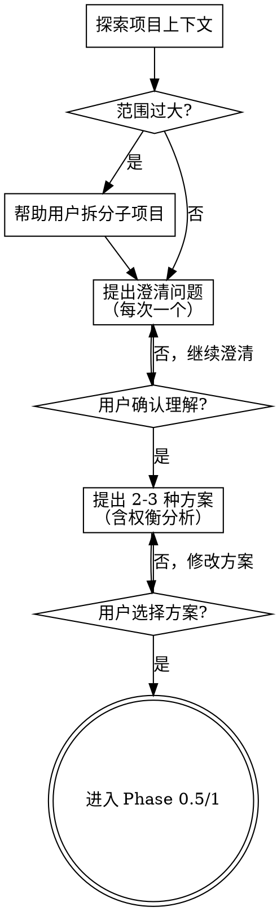

# GS3-Hybrid 技能包模块化改造实施计划

> **面向 AI 代理的工作者：** 必需子技能：使用 superpowers:subagent-driven-development（推荐）或 superpowers:executing-plans 逐任务实现此计划。步骤使用复选框（`- [ ]`）语法来跟踪进度。

**目标：** 将当前单一 2200+ 行的 SKILL.md 拆分为模块化结构，方便维护和演进

**架构：** 采用主入口 + 13 个模块文件的结构，主入口保留元数据、路由表和索引，详细内容分散到各模块文件中

**技术栈：** Markdown 文档组织

---

## 文件清单

### 新增文件（13 个模块）
| 文件路径 | 用途 | 行数预估 | 来源（原 SKILL.md 行号） |
|---------|------|---------|------------------------|
| `.trae/skills/gs3-hybrid/01-intro.md` | 快速开始、项目配置、核心概念 | ~120 | L1-L119 |
| `.trae/skills/gs3-hybrid/02-complexity.md` | 复杂度分级、适用矩阵 | ~70 | L192-L252 |
| `.trae/skills/gs3-hybrid/03a-phase-0-03.md` | Step 0 + Phase 0.3（需求澄清） | ~260 | L256-L506 |
| `.trae/skills/gs3-hybrid/03b-phase-05.md` | Phase 0.5（Design Doc） | ~200 | L509-L703 |
| `.trae/skills/gs3-hybrid/03c-phase-1.md` | Phase 1（逻辑规划） | ~290 | L706-L898 |
| `.trae/skills/gs3-hybrid/04a-phase-2.md` | Phase 2（工程规范设计） | ~90 | L902-L984 |
| `.trae/skills/gs3-hybrid/04b-phase-25.md` | Phase 2.5（前端专项检验） | ~300 | L987-L1283 |
| `.trae/skills/gs3-hybrid/04c-phase-3.md` | Phase 3（架构师评审） | ~60 | L1286-L1340 |
| `.trae/skills/gs3-hybrid/05-phase-4-5.md` | Phase 4-5（QA/安全评审） | ~120 | L1344-L1438 |
| `.trae/skills/gs3-hybrid/06-phase-6-7.md` | Phase 6-7（编码/验证） | ~230 | L1441-L1696 |
| `.trae/skills/gs3-hybrid/07-workflows.md` | 专用流程指令（/plan 等） | ~160 | L1699-L1945 |
| `.trae/skills/gs3-hybrid/08-handling.md` | 异常处理、冲突仲裁、回滚机制 | ~80 | L1947-L2041 |
| `.trae/skills/gs3-hybrid/09-rules.md` | 阻断规则、度量指标 | ~40 | L2045-L2088 |

### 修改文件
| 文件路径 | 变更类型 | 说明 |
|---------|---------|------|
| `.trae/skills/gs3-hybrid/SKILL.md` | 重构为主入口文件 | 精简至 ~250 行，保留元数据、路由表、模块索引 |

---

## 任务分解

### 任务 1：创建 01-intro.md 模块

**文件：**
- 创建：`.trae/skills/gs3-hybrid/01-intro.md`

**内容来源：** 原 SKILL.md L1-L119（快速开始、项目配置、核心概念）

- [ ] **步骤 1：创建模块文件**

```markdown
---
name: "gs3-hybrid/01-intro"
description: "GS3-Hybrid 快速开始、项目配置、核心概念"
---

# 01 - 快速开始与项目配置

## 快速开始

### 启动指令

| 指令 | 流程 | 说明 |
|------|------|------|
| `/plan` 或 `gs3 plan` | 规划流程 | 新功能开发前的完整规划 |
| `/review` 或 `gs3 review` | 代码审查 | 代码完成后的质量审查 |
| `/test` 或 `gs3 test` | 测试驱动 | TDD 开发流程 |
| `/ship` 或 `gs3 ship` | 发布准备 | 提交前的最终检查 |
| `/qa` 或 `gs3 qa` | 质量保证 | 功能完成后的验证 |
| `/debug` 或 `gs3 debug` | 调试助手 | 问题诊断与修复 |
| `/refactor` 或 `gs3 refactor` | 重构建议 | 代码改进与优化 |

### 标准工作流

```
用户: "gs3 帮我开发新功能"

AI: 收到。我将按照 GS3-Hybrid 流程执行：

Step 0:     评估任务复杂度 (L1/L2/L3)
Phase 0.3:  需求澄清 (探索上下文/提问/确认理解/提出方案/用户选择)
            ↓ 用户确认方案
Step 0.5:   L2+ 创建 Design Doc (编号设计文档)
            ↓ 用户审查规格
Phase 1:    生成详细 PLAN.md (前后端分离规划)
            ↓ 用户审查 PLAN
Phase 2:    工程规范设计 (双端规范检查)
Phase 2.5:  前端专项检验 (代码/性能/安全/A11y) [涉及前端时]
Phase 3:    架构师评审 (SOLID 原则)
Phase 4:    QA 评审 (测试策略)
Phase 5:    CSO 安全评审 (安全扫描)
Phase 6:    TDD 编码实现
Phase 7:    验证交付
```

<HARD-GATE>
在用户确认方案、审查规格、审查 PLAN 之前，不要进入下一阶段。这适用于所有任务，无论看起来多简单。
</HARD-GATE>

---

## 项目配置

### ETF-Insight 专用配置

```yaml
# ============================================================
# 后端 Go 配置
# ============================================================
backend:
  language: "Go 1.26"
  test_command: "go test ./... -race"
  coverage_command: "go test ./... -coverprofile=coverage.out"
  bench_command: "go test -bench=. -benchmem ./..."
  lint_command: "gofmt -l . && go vet ./..."
  security_scanner: "gosec ./..."
  build_command: "go build ./..."
  code_review_guide: "https://github.com/golang/go/wiki/CodeReviewComments"
  concurrency_model: "goroutine"
  injection_patterns:
    - "fmt\\.Sprintf.*%s.*query"
    - "exec\\.Command.*input"
  secret_patterns:
    - "password\\s*=\\s*[\"'][^\"']+[\"']"
    - "api_key\\s*=\\s*[\"'][^\"']+[\"']"

# ============================================================
# 前端 React/TypeScript 配置
# ============================================================
frontend:
  language: "TypeScript 5.9 + React 19"
  test_command: "npm run test"
  coverage_command: "npm run test:coverage"
  lint_command: "npm run lint"
  typecheck_command: "npx tsc --noEmit"
  build_command: "npm run build"
  code_review_guide: "https://github.com/airbnb/javascript"
  concurrency_model: "async/await"

# ============================================================
# 项目结构
# ============================================================
project:
  name: "ETF-Insight"
  type: "fullstack"
  backend_path: "./backend"
  frontend_path: "./frontend"
  docs_path: "./docs"
  design_docs_path: "./docs/superpowers/specs"
```

---

## 核心概念

| 概念 | 定义 |
|-----|------|
| **Design Doc** | 编号设计文档，存储在 `docs/superpowers/specs/` 目录，记录重大功能/改动的调研、设计决策和演进理由 |
| **变更文件数** | 新增、修改、删除的文件总数（不含自动生成文件） |
| **新增代码行** | 不含空行和注释的净增代码行数 |
| **架构影响** | 涉及模块间接口、数据流、部署方式的变更 |
| **风险等级** | 低：仅影响非核心功能；中：影响核心功能但可回滚；高：涉及数据迁移或不可逆变更 |
| **前后端联动** | 单端（仅后端或仅前端）/ 双端（前后端都需要修改） |
```

- [ ] **步骤 2：验证文件创建成功**

运行：`ls -la .trae/skills/gs3-hybrid/01-intro.md`
预期：文件存在

---

### 任务 2：创建 02-complexity.md 模块

**文件：**
- 创建：`.trae/skills/gs3-hybrid/02-complexity.md`

**内容来源：** 原 SKILL.md L192-L252（复杂度分级、适用矩阵）

- [ ] **步骤 1：创建模块文件**

```markdown
---
name: "gs3-hybrid/02-complexity"
description: "GS3-Hybrid 任务复杂度分级与流程适用矩阵"
---

# 02 - 任务复杂度分级

## 判定标准

| 维度 | L1 简单 | L2 中等 | L3 复杂 |
|------|---------|---------|---------|
| 变更文件数 | < 3 | 3-8 | > 8 |
| 新增代码行 | < 100 | 100-500 | > 500 |
| 接口变更 | 无 | 新增 | 修改/删除 |
| 架构影响 | 无 | 局部 | 全局 |
| 依赖变更 | 无 | 新增依赖 | 替换核心依赖 |
| 前后端联动 | 单端 | 单端 | 双端 |
| 风险等级 | 低 | 中 | 高 |

## 复杂度判定决策树

```
开始
  │
  ├─ 是否涉及架构重构？
  │   ├─ 是 → L3
  │   └─ 否 ↓
  │
  ├─ 是否涉及安全或性能关键路径？
  │   ├─ 是 → L3
  │   └─ 否 ↓
  │
  ├─ 修改文件数 > 8？
  │   ├─ 是 → L3
  │   └─ 否 ↓
  │
  ├─ 新增代码 > 500 行？
  │   ├─ 是 → L3
  │   └─ 否 ↓
  │
  ├─ 修改文件数 >= 3？
  │   ├─ 是 ↓
  │   │   ├─ 新增接口或模块？ → L2
  │   │   └─ 影响现有功能？ → L2
  │   └─ 否 ↓
  │
  └─ L1 (简单任务)
```

## 流程适用矩阵

| Phase | 名称 | L1 | L2 | L3 | 说明 |
|:-----:|------|:--:|:--:|:--:|------|
| 0 | 复杂度评估 | ✅ | ✅ | ✅ | 所有任务必须 |
| 0.3 | 需求澄清 | ✅ | ✅ | ✅ | **所有任务必须**（新增） |
| 0.5 | Design Doc | ⚪ | 🔴 | 🔴 | L2+ 必须 |
| 1 | 逻辑规划 | ✅(简化) | ✅ | ✅ | 前后端分离规划 |
| 2 | 工程规范设计 | ⚪ | 🟡 | 🔴 | 双端规范检查 |
| 2.5 | 前端专项检验 | ⚪ | 🟡 | 🔴 | 前端代码/性能/安全/A11y |
| 3 | 架构师评审 | ⚪ | 🟡 | 🔴 | SOLID 原则 |
| 4 | QA 评审 | ⚪ | ⚪ | 🔴 | 测试策略 |
| 5 | CSO 安全评审 | ⚪ | ⚪ | 🔴 | 安全扫描 |
| 6 | 编码实现 | ✅ | ✅ | ✅ | TDD 流程 |
| 7 | 验证交付 | ✅(简化) | ✅ | ✅ | 质量门禁 |

> 图例: ✅ 必须 | 🟡 L2+ 必须 | 🔴 L3 必须 | ⚪ 可选
```

- [ ] **步骤 2：验证文件创建成功**

---

### 任务 3：创建 03a-phase-0-03.md 模块

**文件：**
- 创建：`.trae/skills/gs3-hybrid/03a-phase-0-03.md`

**内容来源：** 原 SKILL.md L256-L506（Step 0 + Phase 0.3）

- [ ] **步骤 1：创建模块文件**

```markdown
---
name: "gs3-hybrid/03a-phase-0-03"
description: "GS3-Hybrid Step 0 复杂度评估 + Phase 0.3 需求澄清"
---

# 03a - Step 0: 复杂度评估 & Phase 0.3: 需求澄清

## Step 0: 复杂度评估

**触发**: 任何任务开始前

### 评估清单

```markdown
## 复杂度评估报告

### 变更统计
- 新增文件: __ 个
- 修改文件: __ 个
- 删除文件: __ 个
- 预估后端代码行: __ 行
- 预估前端代码行: __ 行

### 影响分析
- [ ] 影响后端 API 接口
- [ ] 影响前端页面/组件
- [ ] 影响数据库模型
- [ ] 需要前后端联调
- [ ] 涉及第三方依赖变更
- [ ] 影响配置文件
- [ ] 影响部署流程

### 评估结论
**复杂度级别**: L1 / L2 / L3
**涉及端**: 后端 / 前端 / 双端
**流程选择**: 简化流程 / 标准流程 / 完整流程
**预计耗时**: __ 小时
```

---

## Phase 0.3: 需求澄清（所有任务必须）

**触发**: Step 0 复杂度评估完成后 | **适用级别**: ✅ L1/L2/L3 所有任务

> **⚠️ 必须加载 Skill**: 在开始此阶段前，执行 `Skill("brainstorming")` 加载头脑风暴 skill。

> **核心理念**: 在动手设计之前，先理解用户真正想要什么。借鉴 brainstorming skill 的提问方法。

<HARD-GATE>
在用户确认方案之前，不要进入 Phase 0.5 或 Phase 1。这适用于所有任务，无论看起来多简单。
</HARD-GATE>

### 检查清单

你必须为以下每个条目创建任务，并按顺序完成：

1. **探索项目上下文** — 检查文件、文档、最近的 commit
2. **评估范围** — 是否需要拆分为子项目？
3. **提出澄清问题** — 每次一个，了解目的/约束/成功标准
4. **确认理解** — 复述需求，获得用户确认
5. **提出 2-3 种方案** — 附带权衡分析和你的推荐
6. **获得方案确认** — 用户选择并批准方案

### 流程图



### 0.3.1 探索项目上下文

在提出问题之前，先了解当前项目状态：

```markdown
## 项目上下文检查

### 必读文档
- [ ] AGENTS.md — 项目规范和约束
- [ ] README.md — 项目概述
- [ ] 相关设计文档 (docs/superpowers/specs/)

### 代码探索
- [ ] 检查相关模块的现有实现
- [ ] 了解现有架构和模式
- [ ] 识别潜在的影响范围

### 最近变更
- [ ] 查看最近的 commit 历史
- [ ] 了解当前开发方向
```

### 0.3.2 评估范围

在提出详细问题之前，先评估范围：

**范围过大信号**：
- 需求描述了多个独立子系统
- 例如："构建一个包含聊天、文件存储、计费和分析的平台"

**处理方式**：
- 立即指出范围过大
- 帮助用户分解为子项目
- 确定各子项目的关系和优先级
- 然后对第一个子项目进行需求澄清

### 0.3.3 提出澄清问题

**核心原则**：
- **每次一个问题** — 不要同时抛出多个问题
- **优先选择题** — 在可能的情况下比开放式问题更容易回答
- **聚焦核心** — 目的、约束、成功标准

**问题类型**：

| 类型 | 目的 | 示例问题 |
|------|------|---------|
| **目的** | 理解"为什么" | "这个功能主要解决什么问题？" |
| **约束** | 理解限制条件 | "有技术栈/时间/资源的限制吗？" |
| **成功标准** | 理解完成定义 | "怎样算这个功能完成了？" |
| **边界** | 理解范围 | "这个功能需要支持哪些场景？" |
| **优先级** | 理解重要性 | "这个功能是 P0/P1/P2？" |

**提问示例**：

```
❌ 错误：一次问多个问题
"这个功能是给谁用的？需要在什么时间完成？有性能要求吗？"

✅ 正确：每次一个问题
"这个功能主要解决什么问题？"
（等待用户回答）
"明白了。那有技术栈或时间上的限制吗？"
（等待用户回答）
"好的。怎样算这个功能完成了？"
```

### 0.3.4 确认理解

在提问结束后，复述你的理解并获得用户确认：

```markdown
## 需求理解确认

### 我的理解
- **目的**: [复述用户的目的]
- **约束**: [复述约束条件]
- **成功标准**: [复述成功标准]
- **范围**: [复述功能范围]

### 请确认
以上理解是否正确？如有遗漏或误解，请告诉我。
```

### 0.3.5 提出 2-3 种方案（关键环节）

**在用户确认理解后，必须提出 2-3 种不同的实现方案**。

**方案展示模板**：

```markdown
## 实现方案

基于以上理解，我提出以下几种实现方案：

### 方案 A: [名称] ⭐ 推荐
- **描述**: [简要描述]
- **优点**:
  - [优点1]
  - [优点2]
- **缺点**:
  - [缺点1]
- **工作量**: 小/中/大
- **推荐理由**: [为什么推荐这个方案]

### 方案 B: [名称]
- **描述**: [简要描述]
- **优点**:
  - [优点1]
- **缺点**:
  - [缺点1]
  - [缺点2]
- **工作量**: 小/中/大

### 方案 C: [名称]（如有）
- **描述**: [简要描述]
- **优点**:
  - [优点1]
- **缺点**:
  - [缺点1]
- **工作量**: 小/中/大

---

**我的推荐**: 方案 A，因为 [理由]。

请问你倾向于哪个方案？或者有其他想法？
```

**方案对比要点**：

| 维度 | 说明 |
|------|------|
| **技术复杂度** | 实现难度、技术风险 |
| **工作量** | 预估开发时间 |
| **可维护性** | 长期维护成本 |
| **扩展性** | 未来扩展能力 |
| **性能** | 运行效率 |

### 0.3.6 获得方案确认

**用户可能的选择**：
1. **选择某个方案** → 进入 Phase 0.5/1
2. **要求修改方案** → 调整后重新展示
3. **提出新想法** → 讨论并纳入方案对比

**确认话术**：
```
好的，你选择了方案 [A/B/C]。我将基于这个方案进入下一阶段。
```

### 0.3.7 强制检查清单

- [ ] 是否已阅读 AGENTS.md 和相关文档？
- [ ] 是否已检查现有代码结构？
- [ ] 是否已理解用户的目的？
- [ ] 是否已识别约束条件？
- [ ] 是否已确认成功标准？
- [ ] 用户是否确认了你的理解？
- [ ] 是否提出了 2-3 种方案？
- [ ] 用户是否选择了方案？

**⚠️ 阻断规则**: 未完成以上所有步骤，禁止进入 Phase 0.5 或 Phase 1

### 反模式："这个太简单了，不需要方案对比"

每个任务都要经过这个流程。一个简单的配置变更、一个单函数工具——全都可能有多种实现方式。方案对比可以很简短（对于真正简单的任务几句话就够了），但你必须展示出来并获得用户批准。
```

- [ ] **步骤 2：验证文件创建成功**

---

### 任务 4：创建 03b-phase-05.md 模块

**文件：**
- 创建：`.trae/skills/gs3-hybrid/03b-phase-05.md`

**内容来源：** 原 SKILL.md L509-L703（Phase 0.5 Design Doc）

- [ ] **步骤 1：创建模块文件**

```markdown
---
name: "gs3-hybrid/03b-phase-05"
description: "GS3-Hybrid Phase 0.5 Design Doc 编写规范"
---

# 03b - Phase 0.5: Design Doc (研究 & 设计)

**触发**: Step 0 评估为 L2/L3 | **适用级别**: 🔴 L2+ 必须，⚪ L1 可选

## Design Doc 价值

| 价值 | 说明 |
|-----|------|
| **思考留痕** | 记录调研过程、方案对比、决策理由 |
| **可追溯性** | 编号递增 + Git 提交，可回溯设计决策 |
| **知识传承** | 新成员通过 docs/superpowers/specs/ 快速理解项目演进 |
| **减少返工** | 先思考后编码，避免方向性错误 |
| **评审依据** | Phase 2-5 评审的基础材料 |

## 文件命名规范

```
docs/superpowers/specs/
├── 001-feature-name.md
├── 002-another-feature.md
├── README.md          # 索引文件
└── archive/           # 归档文档
```

**命名规则**: `YYYY-MM-DD-kebab-case-title.md`
- `NNN`: 三位数字，从 001 开始递增
- `kebab-case-title`: 简短英文描述
- 编号必须连续，不允许跳号

## Design Doc 模板

```markdown
# Design Doc NNN: [标题]

## 元数据
- **编号**: NNN
- **标题**: [简短描述]
- **状态**: draft / approved / superseded / deprecated
- **创建日期**: YYYY-MM-DD
- **最后更新**: YYYY-MM-DD
- **关联任务**: [任务描述或 issue 编号]
- **复杂度级别**: L2 / L3
- **涉及端**: 后端 / 前端 / 双端
- **前置 Design Doc**: [如有关联，填写编号]

## 1. 背景与动机
- 为什么需要这个改动？
- 当前系统的痛点是什么？
- 业务/技术驱动因素

## 2. 调研与现状分析

### 2.1 现有实现
- 当前架构/代码如何工作
- 已有的限制和瓶颈

### 2.2 业界实践
- 同类系统的解决方案
- 开源参考实现
- 相关论文/文章

### 2.3 技术约束
- 语言/框架限制
- 兼容性要求
- 性能约束

## 3. 可选方案

### 方案 A: [名称]
- **描述**:
- **优点**:
- **缺点**:
- **工作量**: 小/中/大

### 方案 B: [名称]
- **描述**:
- **优点**:
- **缺点**:
- **工作量**: 小/中/大

### 方案 C: [名称] (如有)
- **描述**:
- **优点**:
- **缺点**:
- **工作量**: 小/中/大

## 4. 决策
- **选定方案**: [A/B/C]
- **决策理由**:
- **权衡取舍**:

## 5. 后端设计
### API 接口
```go
// 接口定义
```

### 数据模型
```go
// 模型定义
```

## 6. 前端设计
### 组件结构
```
Component/
├── index.tsx
├── types.ts
└── utils.ts
```

### API 调用
```typescript
// API 封装
```

## 7. 前后端交互
### 请求/响应格式
```json
{
  "success": true,
  "data": {},
  "message": ""
}
```

## 8. 影响范围
- 影响的模块/包
- 影响的接口
- 影响的配置
- 影响的部署

## 9. 开放问题
- [ ] 待解决问题 1
- [ ] 待解决问题 2

---
**文档状态**: draft
```

## README.md 索引模板

```markdown
# Design Docs

> 本目录记录项目的重大设计决策，类似 DB Migrations。

## 文档索引

| 编号 | 标题 | 状态 | 创建日期 | 涉及端 | 关联 |
|-----|------|------|---------|--------|------|
| 001 | [标题](001-title.md) | approved | YYYY-MM-DD | 后端 | - |
| 002 | [标题](002-title.md) | draft | YYYY-MM-DD | 双端 | 001 |

## 状态说明

| 状态 | 含义 |
|-----|------|
| draft | 草稿，尚未评审 |
| approved | 已通过评审，可进入实现 |
| superseded | 被后续文档取代 |
| deprecated | 已废弃，不再适用 |
```

## 强制检查清单
- [ ] 是否创建了 docs/superpowers/specs/ 目录？
- [ ] 是否确定了正确的编号 (NNN)？
- [ ] 是否使用了标准模板？
- [ ] 是否包含至少 2 个可选方案的对比？
- [ ] 是否记录了决策理由？
- [ ] 是否更新了 README.md 索引？
- [ ] 是否提交到了仓库？

## 规格自检

编写规格文档后，以全新的视角审视它：

1. **占位符扫描**: 有没有"待定"、"TODO"、未完成的章节或模糊的需求？修复它们。
2. **内部一致性**: 各章节之间有矛盾吗？架构和功能描述匹配吗？
3. **范围检查**: 这是否聚焦到可以用一个实现计划覆盖，还是需要进一步拆分？
4. **模糊性检查**: 有没有需求可以被两种方式理解？如果有，选择一种并明确写出来。

发现问题就直接内联修复。无需重新审查——修好继续推进。

## 用户审查规格（关键关卡）

**规格自检完成后，必须请用户审查书面规格**：

> "规格已编写并 commit 到 `<path>`。请审查一下，如果在我们开始编写实现计划之前你想做任何修改，请告诉我。"

**等待用户回复**：
- 如果用户要求修改 → 做出修改并重新运行规格自检
- 只有在用户批准后才继续进入 Phase 1

**⚠️ 阻断规则**: L2+ 任务未完成 Design Doc 或用户未批准规格，禁止进入 Phase 1
```

- [ ] **步骤 2：验证文件创建成功**

---

### 任务 5：创建 03c-phase-1.md 模块

**文件：**
- 创建：`.trae/skills/gs3-hybrid/03c-phase-1.md`

**内容来源：** 原 SKILL.md L706-L898（Phase 1 逻辑规划）

- [ ] **步骤 1：创建模块文件**

```markdown
---
name: "gs3-hybrid/03c-phase-1"
description: "GS3-Hybrid Phase 1 逻辑规划与 PLAN.md 编写"
---

# 03c - Phase 1: 逻辑规划

**触发**: 任何任务（L2+ 需先完成 Phase 0.5）

**强制输出**: `PLAN.md`

## 后端规划模板

```markdown
# 后端实现计划

## 1. 需求概述
- **功能名称**:
- **API 路径**: `METHOD /api/xxx`
- **复杂度**: L1/L2/L3
- **Design Doc**: [YYYY-MM-DD-title](../docs/superpowers/specs/YYYY-MM-DD-title.md) (L2+ 必填)

## 2. 变更文件

### 新增文件
| 文件路径 | 用途 | 行数预估 |
|---------|------|---------|
| `services/xxx_service.go` | 业务逻辑 | ~200 |
| `services/xxx_service_test.go` | 单元测试 | ~150 |
| `handlers/xxx_handler.go` | HTTP 处理 | ~100 |
| `models/xxx.go` | 数据模型 | ~50 |

### 修改文件
| 文件路径 | 变更类型 | 影响范围 |
|---------|---------|---------|
| `router/router.go` | 添加路由 | 新增接口 |
| `models/db.go` | 注册模型 | 自动迁移 |

### 删除文件
| 文件路径 | 原因 |
|---------|------|
| 无 | - |

## 3. 接口设计
```go
type XXXRequest struct {
    Field string `json:"field" binding:"required"`
}

type XXXResponse struct {
    Data interface{} `json:"data"`
}
```

## 4. 核心逻辑
```
[流程图或伪代码]
```

## 5. 边界条件
| 场景 | 输入 | 预期输出 | 处理方式 |
|-----|------|---------|---------|
| 正常情况 | ... | ... | ... |
| 空输入 | ... | ... | 返回 400 错误 |
| 超大输入 | ... | ... | 分页处理 |
| 数据库错误 | ... | ... | 返回 500 错误 |
| 并发访问 | ... | ... | 加锁处理 |

## 6. 测试策略
- [ ] 单元测试覆盖率 >= 80%
- [ ] 边界条件测试
- [ ] 错误处理测试
- [ ] 并发测试（如需要）

## 7. 依赖分析
### 内部依赖
- `services/xxx` - 用途
- `models/xxx` - 用途

### 外部依赖
- 无新增 / `library/xxx` - 用途

### 循环依赖风险
- [ ] 无风险
- [ ] 有风险，解决方案：...

## 8. 风险评估
| 风险类型 | 概率 | 影响 | 缓解措施 |
|---------|------|------|---------|
| 性能瓶颈 | 中 | 高 | 提前基准测试 |
| 向后不兼容 | 低 | 高 | 保留旧接口 |

## 9. 验收标准
- [ ] 功能实现完整
- [ ] 测试覆盖率达标
- [ ] 性能指标满足
- [ ] 文档更新完成

## 10. 回滚策略
- [ ] 数据库迁移可回滚
- [ ] 配置变更可回滚
- [ ] 功能开关控制

---
**计划状态**: 待评审
**创建时间**: YYYY-MM-DD
**最后更新**: YYYY-MM-DD
```

## 前端规划模板

```markdown
# 前端实现计划

## 1. 需求概述
- **功能名称**:
- **页面路由**: `/xxx`
- **复杂度**: L1/L2/L3
- **Design Doc**: [YYYY-MM-DD-title](../docs/superpowers/specs/YYYY-MM-DD-title.md) (L2+ 必填)

## 2. 变更文件

### 新增文件
| 文件路径 | 用途 | 行数预估 |
|---------|------|---------|
| `src/pages/XXXPage.tsx` | 页面组件 | ~200 |
| `src/components/XXXComponent.tsx` | 子组件 | ~150 |
| `src/hooks/useXXX.ts` | 自定义 Hook | ~100 |
| `src/services/xxxAPI.ts` | API 封装 | ~80 |
| `src/types/xxx.ts` | 类型定义 | ~50 |

### 修改文件
| 文件路径 | 变更类型 |
|---------|---------|
| `src/App.tsx` | 添加路由 |
| `src/services/api.ts` | 添加 API |

## 3. 组件设计
```typescript
// 组件接口
interface XXXProps {
  data: XXXData;
  onSubmit: (values: XXXForm) => void;
}
```

## 4. 状态管理
- **本地状态**: useState
- **服务端状态**: React Query / SWR
- **全局状态**: Context / Redux (如需)

## 5. 边界条件
| 场景 | 处理方式 |
|-----|---------|
| 加载中 | Loading 组件 |
| 空数据 | Empty 状态 |
| 错误 | Error Boundary |
| 网络失败 | 重试机制 |

## 6. 测试策略
- [ ] 组件渲染测试
- [ ] 用户交互测试
- [ ] API Mock 测试

## 7. 性能考虑
- [ ] 组件懒加载
- [ ] 数据缓存
- [ ] 虚拟列表（大数据）

## 8. 风险评估
| 风险 | 概率 | 影响 | 缓解措施 |
|-----|------|------|---------|
| 浏览器兼容 | 低 | 中 | 提前测试 |

---
**计划状态**: 待评审
```

## 强制检查清单
- [ ] 是否生成了 PLAN.md?
- [ ] 是否列出了所有变更文件?
- [ ] 是否识别了边界条件?
- [ ] 是否评估了风险?
- [ ] 是否制定了回滚策略?
- [ ] L2+ 是否引用了 Design Doc 编号?

## 用户审查 PLAN（关键关卡）

**PLAN 生成后，必须请用户审查实现计划**：

> "实现计划已生成，保存在 `<path>`。请审查一下，确认是否可以开始实施？如有调整需求，请告诉我。"

**等待用户回复**：
- 如果用户要求修改 → 调整 PLAN.md 并重新请用户确认
- 只有在用户批准后才继续进入 Phase 2

**⚠️ 阻断规则**: 未完成以上检查或用户未批准 PLAN，禁止进入 Phase 2
```

- [ ] **步骤 2：验证文件创建成功**

---

### 任务 6：创建 04a-phase-2.md 模块

**文件：**
- 创建：`.trae/skills/gs3-hybrid/04a-phase-2.md`

**内容来源：** 原 SKILL.md L902-L984（Phase 2 工程规范设计）

- [ ] **步骤 1：创建模块文件**

```markdown
---
name: "gs3-hybrid/04a-phase-2"
description: "GS3-Hybrid Phase 2 工程规范设计"
---

# 04a - Phase 2: 工程规范设计（L2+）

## 后端规范检查

```markdown
## 后端工程规范检查

### 架构设计
- [ ] 符合三层架构（Handler-Service-Model）
- [ ] 无循环依赖
- [ ] 接口粒度适中（方法数 < 10）
- [ ] 依赖注入支持

### 代码规范
- [ ] 遵循 Go 官方代码规范
- [ ] 使用 `gofmt` 格式化
- [ ] 函数长度 < 50 行
- [ ] 圈复杂度 < 10
- [ ] 嵌套深度 < 3
- [ ] 命名清晰（动词+名词）
- [ ] 注释解释"为什么"而非"做什么"

### 金融计算规范
- [ ] 使用 `decimal.Decimal` 处理金额
- [ ] 收益率统一使用百分比
- [ ] 波动率使用年化值
- [ ] 除零保护

### 错误处理
- [ ] 所有错误必须处理
- [ ] 使用 `fmt.Errorf("context: %w", err)` 包装
- [ ] 不忽略错误（避免 `_ = xxx`）
- [ ] 返回有意义的错误信息

### 并发安全
- [ ] 共享数据加锁
- [ ] Goroutine 有退出机制
- [ ] 使用 `context` 控制超时
- [ ] 无 Goroutine 泄漏

### 性能评估
| 操作 | 复杂度 | 是否可接受 |
|-----|--------|:---------:|
| 读取 | O(n) | ✅ |
| 写入 | O(log n) | ✅ |
```

## 前端规范检查

```markdown
## 前端工程规范检查

### TypeScript 规范
- [ ] 严格类型检查（禁用 `any`）
- [ ] 接口定义完整
- [ ] 枚举使用常量
- [ ] 泛型合理使用

### React 规范
- [ ] 函数式组件
- [ ] Hooks 规范使用
- [ ] 组件粒度适中（< 300 行）
- [ ] Props 类型定义
- [ ] 依赖数组完整

### 代码组织
- [ ] 按功能组织目录
- [ ] 公共逻辑抽离 Hooks
- [ ] API 统一封装
- [ ] 类型集中管理

### 性能优化
- [ ] 使用 `React.memo`（如需要）
- [ ] 使用 `useMemo`/`useCallback`（如需要）
- [ ] 图片懒加载
- [ ] 代码分割

### 可访问性
- [ ] 语义化 HTML
- [ ] ARIA 标签
- [ ] 键盘导航
```
```

- [ ] **步骤 2：验证文件创建成功**

---

### 任务 7：创建 04b-phase-25.md 模块

**文件：**
- 创建：`.trae/skills/gs3-hybrid/04b-phase-25.md`

**内容来源：** 原 SKILL.md L987-L1283（Phase 2.5 前端专项检验）

- [ ] **步骤 1：创建模块文件**

```markdown
---
name: "gs3-hybrid/04b-phase-25"
description: "GS3-Hybrid Phase 2.5 前端专项检验"
---

# 04b - Phase 2.5: 前端专项检验（L2+）

**触发**: Phase 2 通过后，涉及前端变更的任务 | **适用级别**: 🟡 L2+ 必须，⚪ L1 可选

> 专门针对前端代码的深度检验，包括代码质量、性能、安全性和可访问性

## 2.5.1 前端代码质量检验

```markdown
## 前端代码质量检验

### TypeScript 严格性检查
- [ ] **无 `any` 类型**: 所有变量/参数必须有明确类型
- [ ] **无 `@ts-ignore`**: 除非有详细注释说明原因
- [ ] **无 `@ts-expect-error`**: 临时禁用需标记 TODO
- [ ] **严格 null 检查**: 启用 `strictNullChecks`
- [ ] **严格模式**: 启用 `strict: true`

### 代码复杂度检查
| 指标 | 阈值 | 检查工具 |
|-----|------|---------|
| 组件行数 | < 300 行 | 人工检查 |
| 函数行数 | < 50 行 | 人工检查 |
| 圈复杂度 | < 10 | eslint-plugin-complexity |
| 嵌套深度 | < 4 层 | 人工检查 |
| Props 数量 | <= 7 个 | 人工检查 |

### 代码规范检查
- [ ] **命名规范**:
  - 组件: PascalCase (e.g., `UserProfile`)
  - Hook: camelCase 前缀 `use` (e.g., `useAuth`)
  - 工具函数: camelCase (e.g., `formatDate`)
  - 常量: SCREAMING_SNAKE_CASE
- [ ] **文件组织**: 每个文件一个主要导出
- [ ] **导入排序**: 第三方库 → 内部模块 → 相对路径
- [ ] **无未使用变量/导入**: ESLint `no-unused-vars`
- [ ] **无 console.log**: 生产代码移除或改用 logger

### 注释规范
- [ ] 复杂逻辑必须注释
- [ ] 公共 API 必须有 JSDoc
- [ ] 无注释掉的代码块
- [ ] TODO/FIXME 必须有 Issue 链接
```

## 2.5.2 前端性能检验

```markdown
## 前端性能检验

### 构建性能
| 指标 | 目标值 | 检查命令 |
|-----|--------|---------|
| 构建时间 | < 30s | `npm run build` |
| 包体积 | < 500KB (gzip) | `npm run analyze` |
| Chunk 数量 | < 20 个 | 构建输出 |

### 运行时性能
| 指标 | 目标值 | 检查工具 |
|-----|--------|---------|
| 首屏加载 (FCP) | < 1.8s | Lighthouse |
| 可交互时间 (TTI) | < 3.8s | Lighthouse |
| 累积布局偏移 (CLS) | < 0.1 | Lighthouse |
| 最大内容绘制 (LCP) | < 2.5s | Lighthouse |
| 总阻塞时间 (TBT) | < 200ms | Lighthouse |

### 代码性能检查
- [ ] **无内存泄漏**:
  - 组件卸载时清理定时器/订阅
  - 事件监听正确移除
  - 闭包不持有大对象引用
- [ ] **渲染优化**:
  - 大数据列表使用虚拟滚动
  - 图表使用 Canvas/WebGL (数据量大时)
  - 避免不必要的重渲染
- [ ] **网络优化**:
  - API 请求防抖/节流
  - 图片懒加载
  - 资源预加载关键资源
- [ ] **状态优化**:
  - 状态粒度适中
  - 避免深层嵌套状态
  - 使用 selector 减少重渲染

### 性能检测命令
```bash
# Lighthouse 检测
cd frontend && npx lighthouse http://localhost:5173 --preset=desktop

# 包体积分析
cd frontend && npm run build && npx vite-bundle-visualizer

# 性能分析（开发模式）
cd frontend && npm run dev
# Chrome DevTools → Performance → Record
```
```

## 2.5.3 前端安全检验

```markdown
## 前端安全检验

### XSS 防护检查
- [ ] **无 `dangerouslySetInnerHTML`**: 除非内容已净化
- [ ] **无 `innerHTML` 直接赋值**: 使用 textContent 替代
- [ ] **无 `eval()`**: 使用 JSON.parse 或 Function 构造器
- [ ] **无 `new Function()`**: 动态代码执行风险
- [ ] **URL 校验**: 跳转前校验 URL 协议
- [ ] **富文本净化**: 使用 DOMPurify 净化用户输入

### CSRF 防护检查
- [ ] **请求携带 Token**: 所有修改请求带 CSRF Token
- [ ] **SameSite Cookie**: Cookie 设置 SameSite 属性
- [ ] **验证 Origin/Referer**: 敏感操作验证来源

### 敏感数据处理
- [ ] **无 LocalStorage 存敏感信息**: token 存 httpOnly cookie
- [ ] **无 URL 传敏感参数**: 使用 POST body 或 Header
- [ ] **日志脱敏**: 错误日志不打敏感字段
- [ ] **表单自动完成**: 敏感字段关闭 autocomplete

### 依赖安全检查
```bash
# 检查已知漏洞
cd frontend && npm audit

# 检查过时依赖
cd frontend && npm outdated

# 许可证检查
cd frontend && npx license-checker --onlyAllow 'MIT;Apache-2.0;BSD-3-Clause'
```

### 安全扫描规则
```yaml
frontend_security_rules:
  xss_risk:
    - pattern: "dangerouslySetInnerHTML"
      severity: high
      message: "必须使用 DOMPurify 净化内容"
    - pattern: "innerHTML\\s*="
      severity: high
      message: "使用 textContent 或 React 的 JSX 替代"
    - pattern: "eval\\("
      severity: critical
      message: "禁止使用 eval"

  sensitive_storage:
    - pattern: "localStorage\\.setItem.*token"
      severity: high
      message: "Token 应存储在 httpOnly cookie"
    - pattern: "localStorage\\.setItem.*password"
      severity: critical
      message: "禁止在 LocalStorage 存储密码"

  insecure_api:
    - pattern: "axios\\.get.*params.*password"
      severity: high
      message: "敏感信息不应通过 URL 参数传递"
```
```

## 2.5.4 前端可访问性检验 (A11y)

```markdown
## 前端可访问性检验 (A11y)

### 语义化 HTML
- [ ] **正确使用标题层级**: h1 → h2 → h3，不跳过
- [ ] **表单关联标签**: `<label for="id">` 或包裹 input
- [ ] **按钮可识别**: 使用 `<button>` 而非 `<div onClick>`
- [ ] **链接可识别**: 使用 `<a href>` 而非 `<div onClick>`
- [ ] **列表结构**: 使用 `<ul>/<ol>/<li>` 而非 div 模拟
- [ ] **表格结构**: 使用 `<table>` 相关标签，含 `<th>`

### ARIA 标签
- [ ] **必要 ARIA 属性**:
  - 自定义控件: `role`, `aria-label`, `aria-describedby`
  - 动态内容: `aria-live`, `aria-atomic`
  - 状态指示: `aria-expanded`, `aria-selected`, `aria-hidden`
- [ ] **无冗余 ARIA**: 原生 HTML 语义足够时不加 ARIA
- [ ] **ARIA 状态同步**: 视觉状态与 ARIA 状态一致

### 键盘导航
- [ ] **Tab 顺序合理**: 符合视觉顺序
- [ ] **焦点可见**: 所有交互元素有焦点样式
- [ ] **焦点陷阱**: 弹窗/菜单内焦点循环
- [ ] **快捷键**: 提供键盘快捷键（如 Ctrl+K 搜索）
- [ ] **Esc 关闭**: 弹窗/菜单可用 Esc 关闭

### 视觉可访问性
- [ ] **颜色对比度**: 文本对比度 >= 4.5:1 (AA 级)
- [ ] **不依赖颜色**: 错误状态不只靠红色表示
- [ ] **字体大小**: 支持 200% 缩放不失真
- [ ] **动画控制**: 支持 `prefers-reduced-motion`

### 屏幕阅读器支持
- [ ] **图片替代文本**: 所有 `` 有 `alt` 属性
- [ ] **图标说明**: 装饰性图标 `aria-hidden="true"`
- [ ] **状态通知**: 操作结果通过 `aria-live` 通知
- [ ] **跳过链接**: 提供跳转到主内容的链接

### A11y 检测工具
```bash
# axe-core 检测
cd frontend && npm install @axe-core/cli
npx axe http://localhost:5173

# Lighthouse A11y 检测
cd frontend && npx lighthouse http://localhost:5173 --only-categories=accessibility

# ESLint A11y 插件
# 已配置 eslint-plugin-jsx-a11y
npm run lint
```

### A11y 检查清单
| 检查项 | 工具 | 目标 |
|-------|------|------|
| 颜色对比度 | Lighthouse | 100% 通过 |
| ARIA 使用 | axe-core | 0 严重问题 |
| 键盘导航 | 人工测试 | 全部可访问 |
| 屏幕阅读器 | NVDA/VoiceOver | 可正常使用 |
```

## 2.5.5 前端检验报告模板

```markdown
## 前端专项检验报告

### 检验信息
- **检验日期**: YYYY-MM-DD
- **检验范围**: 前端代码 / 性能 / 安全 / A11y
- **检验人员**: AI / 人工

### 代码质量评分
| 维度 | 得分 | 状态 |
|-----|------|:----:|
| TypeScript 严格性 | 95/100 | ✅ |
| 代码复杂度 | 88/100 | ✅ |
| 代码规范 | 92/100 | ✅ |
| **综合评分** | **92/100** | ✅ |

### 性能评分
| 指标 | 实测值 | 目标值 | 状态 |
|-----|--------|--------|:----:|
| FCP | 1.2s | < 1.8s | ✅ |
| TTI | 2.5s | < 3.8s | ✅ |
| CLS | 0.05 | < 0.1 | ✅ |
| 包体积 | 420KB | < 500KB | ✅ |
| **性能评分** | **95/100** | | ✅ |

### 安全评分
| 检查项 | 发现问题 | 状态 |
|-------|---------|:----:|
| XSS 风险 | 0 | ✅ |
| CSRF 防护 | 通过 | ✅ |
| 依赖漏洞 | 0 高危 | ✅ |
| **安全评分** | **100/100** | ✅ |

### 可访问性评分
| 检查项 | 得分 | 状态 |
|-------|------|:----:|
| 语义化 HTML | 95/100 | ✅ |
| ARIA 标签 | 90/100 | ✅ |
| 键盘导航 | 100/100 | ✅ |
| 颜色对比度 | 100/100 | ✅ |
| **A11y 评分** | **96/100** | ✅ |

### 问题清单
| 严重程度 | 问题描述 | 位置 | 修复建议 |
|---------|---------|------|---------|
| 中 | 组件超过 300 行 | `pages/Dashboard.tsx:1` | 拆分为子组件 |
| 低 | 缺少 alt 文本 | `components/Chart.tsx:45` | 添加描述性 alt |

### 检验结论
- **整体状态**: ✅ 通过 / ⚠️ 有条件通过 / 🔴 不通过
- **是否可进入 Phase 3**: 是 / 否
- **备注**:
```

## 2.5.6 强制检查清单
- [ ] TypeScript 严格模式无错误？
- [ ] 组件/函数复杂度在阈值内？
- [ ] Lighthouse 性能评分 >= 90？
- [ ] 无 XSS/CSRF 安全风险？
- [ ] npm audit 无高危漏洞？
- [ ] 可访问性评分 >= 90？
- [ ] 键盘导航完整可用？

**⚠️ 阻断规则**:
- 发现 XSS/CSRF 高危漏洞 → 阻断
- Lighthouse 性能评分 < 70 → 阻断
- 可访问性评分 < 80 → 阻断
- npm audit 发现高危漏洞 → 阻断
```

- [ ] **步骤 2：验证文件创建成功**

---

### 任务 8：创建 04c-phase-3.md 模块

**文件：**
- 创建：`.trae/skills/gs3-hybrid/04c-phase-3.md`

**内容来源：** 原 SKILL.md L1286-L1340（Phase 3 架构师评审）

- [ ] **步骤 1：创建模块文件**

```markdown
---
name: "gs3-hybrid/04c-phase-3"
description: "GS3-Hybrid Phase 3 架构师评审"
---

# 04c - Phase 3: 架构师评审（L2+）

## SOLID 原则检查

```markdown
## 架构师评审报告

### SOLID 原则
- [ ] **S**ingle Responsibility: 每个函数/类职责单一
- [ ] **O**pen/Closed: 对扩展开放，对修改关闭
- [ ] **L**iskov Substitution: 子类可替换父类
- [ ] **I**nterface Segregation: 接口粒度适中
- [ ] **D**ependency Inversion: 依赖抽象而非具体

### 模块划分
```
┌─────────────────────────────────────┐
│           API 路由层                 │
├─────────────────────────────────────┤
│  handlers/  (HTTP 请求处理)          │
│  ├── 职责: 参数解析、调用 Service    │
│  └── 禁止: 业务逻辑                  │
├─────────────────────────────────────┤
│  services/  (业务逻辑层)             │
│  ├── 职责: 核心业务逻辑              │
│  ├── 允许: 调用其他 Service          │
│  └── 禁止: HTTP 相关操作             │
├─────────────────────────────────────┤
│  models/    (数据访问层)             │
│  ├── 职责: 数据模型、数据库操作      │
│  └── 禁止: 业务逻辑                  │
├─────────────────────────────────────┤
│  utils/     (工具函数)               │
│  └── 职责: 纯函数、无状态            │
└─────────────────────────────────────┘
```

### 依赖关系检查
- [ ] Handler → Service → Model（单向依赖）
- [ ] Service 之间可互相调用（避免循环）
- [ ] Utils 被所有层依赖（无反向依赖）

### 接口设计审查
- [ ] 接口粒度适中 (方法数 < 10)
- [ ] 方法命名清晰 (动词+名词)
- [ ] 参数数量合理 (<= 5)
- [ ] 返回值明确
- [ ] 无冗余接口

### 扩展性评估
- [ ] 是否支持水平扩展?
- [ ] 是否支持插件化?
- [ ] 配置是否外部化?
- [ ] 是否支持热更新?
```
```

- [ ] **步骤 2：验证文件创建成功**

---

### 任务 9：创建 05-phase-4-5.md 模块

**文件：**
- 创建：`.trae/skills/gs3-hybrid/05-phase-4-5.md`

**内容来源：** 原 SKILL.md L1344-L1438（Phase 4-5 QA/安全评审）

- [ ] **步骤 1：创建模块文件**

```markdown
---
name: "gs3-hybrid/05-phase-4-5"
description: "GS3-Hybrid Phase 4 QA 评审 + Phase 5 CSO 安全评审"
---

# 05 - Phase 4: QA 评审（L3）& Phase 5: CSO 安全评审（L3）

## Phase 4: QA 评审

### 测试策略

```markdown
## QA 评审

### 后端测试矩阵
| 功能点 | 正常 Case | 异常 Case | 边界 Case |
|-------|:---------:|:---------:|:---------:|
| API 接口 | ✅ | ✅ | ✅ |
| 业务逻辑 | ✅ | ✅ | ✅ |
| 数据库操作 | ✅ | ✅ | ✅ |
| 并发场景 | ⚠️ | ⚠️ | ⚠️ |

### 前端测试矩阵
| 功能点 | 渲染测试 | 交互测试 | E2E 测试 |
|-------|:--------:|:--------:|:--------:|
| 组件 | ✅ | ✅ | ⚠️ |
| 页面 | ✅ | ⚠️ | ⚠️ |
| API 集成 | ⚠️ | ⚠️ | ✅ |

### 边界条件清单
- [ ] 空值处理（null/nil/undefined/""）
- [ ] 超大输入（max length, max items）
- [ ] 并发访问（race condition）
- [ ] 资源耗尽（OOM, disk full）
- [ ] 网络中断（timeout, retry）
- [ ] 编码/时区问题
- [ ] 浏览器兼容（Chrome, Firefox, Safari）

### 性能测试基准
| 指标 | 目标 | 测试方法 |
|-----|------|---------|
| API 响应时间 | P95 < 200ms | 压测工具 |
| 前端首屏加载 | < 3s | Lighthouse |
| 测试覆盖率 | >= 80% | 覆盖率工具 |
```

## Phase 5: CSO 安全评审

### 安全扫描清单

```markdown
## 安全评审

### 后端安全
- [ ] **无硬编码密钥**: API Key 全部环境变量
- [ ] **SQL 注入防护**: 使用参数化查询
- [ ] **输入验证**: 所有用户输入验证
- [ ] **错误信息**: 不暴露敏感信息
- [ ] **日志脱敏**: 敏感字段打码（password/token/api_key）
- [ ] **CORS 配置**: 限制允许域名
- [ ] **速率限制**: 防止暴力攻击

### 前端安全
- [ ] **XSS 防护**: 不直接使用 innerHTML/dangerouslySetInnerHTML
- [ ] **CSRF 防护**: 请求携带 Token
- [ ] **敏感数据**: 不存储在 LocalStorage
- [ ] **依赖安全**: 检查已知漏洞（npm audit）

### 敏感信息检测
```bash
# 搜索潜在风险
grep -r "password\|secret\|api_key\|token" \
  --include="*.go" --include="*.ts" --include="*.tsx" \
  --exclude-dir=node_modules --exclude-dir=vendor
```

### 安全扫描规则
```yaml
security_rules:
  secrets:
    - pattern: "password\\s*=\\s*[\"'][^\"']+[\"']"
      severity: critical
    - pattern: "api_key\\s*=\\s*[\"'][^\"']+[\"']"
      severity: critical

  injection:
    - pattern: "fmt\\.Sprintf.*%s.*query"
      severity: high

  weak_crypto:
    - pattern: "md5|DES|RC4"
      severity: critical
      message: "禁用弱加密算法，使用 AES/SHA256 等"
```

### 合规检查
- [ ] 符合 OWASP Top 10
- [ ] 数据加密（传输 + 静态）
```
```

- [ ] **步骤 2：验证文件创建成功**

---

### 任务 10：创建 06-phase-6-7.md 模块

**文件：**
- 创建：`.trae/skills/gs3-hybrid/06-phase-6-7.md`

**内容来源：** 原 SKILL.md L1441-L1696（Phase 6-7 编码/验证）

- [ ] **步骤 1：创建模块文件**

```markdown
---
name: "gs3-hybrid/06-phase-6-7"
description: "GS3-Hybrid Phase 6 编码实现 + Phase 7 验证交付"
---

# 06 - Phase 6: 编码实现 & Phase 7: 验证交付

## Phase 6: 编码实现

> **⚠️ 必须加载 Skill**: 在开始此阶段前，执行 `Skill("test-driven-development")` 加载 TDD skill。

### TDD 流程

```
红 → 绿 → 重构
│     │      │
│     │      └── 优化代码结构
│     └───────── 编写最小实现
└─────────────── 编写失败测试
```

### 后端 TDD 示例

```markdown
## 后端 TDD 流程

### Step 1: 写测试（红）
```go
func TestCalculateSharpeRatio(t *testing.T) {
    tests := []struct {
        name     string
        input    decimal.Decimal
        expected decimal.Decimal
    }{
        {"正常情况", decimal.NewFromFloat(0.15), decimal.NewFromFloat(0.8)},
        {"零波动率", decimal.NewFromFloat(0), decimal.NewFromFloat(0)},
    }
    for _, tt := range tests {
        t.Run(tt.name, func(t *testing.T) {
            result := CalculateSharpeRatio(tt.input)
            if !result.Equal(tt.expected) {
                t.Errorf("expected %v, got %v", tt.expected, result)
            }
        })
    }
}
```

### Step 2: 运行测试（失败）
```bash
go test ./services/... -v -run TestCalculateSharpeRatio
# 预期: FAIL
```

### Step 3: 写实现（绿）
```go
func CalculateSharpeRatio(returns decimal.Decimal) decimal.Decimal {
    // 最小实现
    if returns.IsZero() {
        return decimal.Zero
    }
    return returns.Mul(decimal.NewFromFloat(5.33))
}
```

### Step 4: 运行测试（通过）
```bash
go test ./services/... -v -run TestCalculateSharpeRatio
# 预期: PASS
```

### Step 5: 重构
- 优化代码结构
- 提取公共函数
- 保持测试通过
```

### 前端编码流程

```markdown
## 前端编码流程

### Step 1: 类型定义
```typescript
// types/optimization.ts
export interface OptimizationRequest {
  symbols: string[];
  objective: 'min_volatility' | 'max_sharpe' | 'target_return';
}

export interface OptimizationResult {
  weights: Record<string, number>;
  expectedReturn: number;
  volatility: number;
}
```

### Step 2: API 封装
```typescript
// services/optimizationAPI.ts
import api from './api';

export const optimizationAPI = {
  optimize: (params: OptimizationRequest) =>
    api.post<OptimizationResult>('/api/portfolio/optimize', params),
};
```

### Step 3: Hook 实现
```typescript
// hooks/useOptimization.ts
import { useMutation } from '@tanstack/react-query';
import { optimizationAPI } from '../services/optimizationAPI';

export const useOptimization = () => {
  return useMutation({
    mutationFn: optimizationAPI.optimize,
  });
};
```

### Step 4: 组件实现
```typescript
// components/OptimizationForm.tsx
import { useOptimization } from '../hooks/useOptimization';

export const OptimizationForm: React.FC = () => {
  const { mutate, isPending, error } = useOptimization();
  // ...
};
```

### Step 5: 测试
```typescript
// components/OptimizationForm.test.tsx
import { render, screen } from '@testing-library/react';
import { OptimizationForm } from './OptimizationForm';

test('renders form', () => {
  render(<OptimizationForm />);
  expect(screen.getByText('优化')).toBeInTheDocument();
});
```

### 提交规范
```bash
# 提交信息格式
git commit -m "feat(optimization): 添加夏普比率计算

- 实现夏普比率计算公式
- 添加边界条件处理
- 单元测试覆盖率 100%

Closes #123"
```
```

### 编码规范

- [ ] 每次提交 < 200 行
- [ ] 提交信息符合 Conventional Commits
- [ ] 测试先行
- [ ] 频繁运行测试 (每 5-10 分钟)

---

## Phase 7: 验证交付

> **⚠️ 必须加载 Skill**: 在开始此阶段前，执行以下 skill：
> - `Skill("verification-before-completion")` — 验证完成
> - `Skill("gstack")` — 如需 QA 测试或浏览器验证

### 后端验证

```bash
# 1. 运行测试
cd backend && go test ./... -v

# 2. 生成覆盖率报告
go test ./... -coverprofile=coverage.out
go tool cover -html=coverage.out -o coverage.html

# 3. 代码格式化检查
gofmt -l .

# 4. 静态分析
go vet ./...

# 5. 构建检查
go build ./...

# 6. 竞态检测
go test ./... -race
```

### 前端验证

```bash
# 1. 类型检查
cd frontend && npx tsc --noEmit

# 2. Lint 检查
npm run lint

# 3. 运行测试
npm run test

# 4. 生成覆盖率报告
npm run test:coverage

# 5. 构建检查
npm run build
```

### 覆盖率报告模板

```markdown
## 测试覆盖率报告

### 后端覆盖率
| 模块 | 覆盖率 | 状态 |
|------|--------|:----:|
| services/optimization | 85% | ✅ |
| services/factor | 72% | ⚠️ |
| handlers | 45% | 🔴 |

### 前端覆盖率
| 模块 | 覆盖率 | 状态 |
|------|--------|:----:|
| components | 60% | ⚠️ |
| pages | 40% | 🔴 |

### 未覆盖代码分析
- `services/xxx.go:45-50` - 错误处理分支，建议补充测试
```

### 交付检查清单

```markdown
## 交付检查清单

### 功能完整性
- [ ] 实现 PLAN.md 中所有功能点
- [ ] 边界条件处理完善
- [ ] 错误处理完善

### 代码质量
- [ ] 后端测试覆盖率 >= 80%
- [ ] 前端组件测试通过
- [ ] 无 Lint 错误
- [ ] 无 TypeScript 类型错误
- [ ] 代码格式化通过

### 文档更新
- [ ] API 文档更新（如需要）
- [ ] AGENTS.md 同步（如需要）
- [ ] CHANGELOG 更新

### 提交准备
- [ ] 提交信息符合规范
- [ ] 相关 Issue 已关联
```
```

- [ ] **步骤 2：验证文件创建成功**

---

### 任务 11：创建 07-workflows.md 模块

**文件：**
- 创建：`.trae/skills/gs3-hybrid/07-workflows.md`

**内容来源：** 原 SKILL.md L1699-L1945（专用流程指令）

- [ ] **步骤 1：创建模块文件**

```markdown
---
name: "gs3-hybrid/07-workflows"
description: "GS3-Hybrid 专用流程指令（/plan /review /ship /debug）"
---

# 07 - 专用流程指令

## `/plan` - 规划流程

```markdown
## 规划流程执行步骤

1. **阅读 AGENTS.md